###Churn/ Customer Retention Modeling


```R
#Load in libraries
library(dplyr)
library(binr)
library(OneR)
library(ggplot2)
library(GGally)
library(car)
library(reshape)
library(devtools)
library(openxlsx)
library(zip)
library(RColorBrewer)
library(caret)
library(e1071)
library(pROC)

# R.Version()
```


```R
# load in the data. The data was pre-cleaned with a mixture of python and R after querying the source data base.
model_data <- read.csv('df_combined_012619.csv')
```


```R
model_data$avg_visits <- apply(select(model_data,starts_with("num_visits")),
                               1,function(x) mean(x,na.rm = TRUE))

model_data$first_month_weightlost <- apply(select(model_data,starts_with("weightchange")),
                                            1,function(x) which(x < 0)[1]) - model_data$first_month_visited

model_data$first_month_weightlost_10 <- apply(select(model_data,starts_with("weightchange")),
                                               1,function(x) which(x <= -10)[1]) - model_data$first_month_visited


model_data$first_month_weightgain <- apply(select(model_data,starts_with("weightchange")),
                                            1,function(x) which(x > 1)[1]) - model_data$first_month_visited


model_data$first_month_weightgain_10 <- apply(select(model_data,starts_with("weightchange")),
                                               1,function(x) which(x >= 10)[1]) - model_data$first_month_visited

model_data$avg_weight_change <- apply(select(model_data,starts_with("weightchange")),
                                       1,function(x) mean(x,na.rm = TRUE))

model_data$stdev_visits <- apply(select(model_data,starts_with("num_visits")),
                                  1,function(x) sd(x,na.rm = TRUE))

model_data$stdev_weight_change <- apply(select(model_data,starts_with("weightchange")),
                                         1,function(x) sd(x,na.rm = TRUE))
```


```R
#Create a generation variable
model_data_discrete$generation <- as.factor(ifelse(is.na(model_data_discrete$birthyear_factor), "Gen X",ifelse(
  model_data_discrete$birthyear_factor <= 1945, "Silent",ifelse(
  model_data_discrete$birthyear_factor <= 1964, "Baby Boomers",
  ifelse(    model_data_discrete$birthyear_factor <= 1979, "Gen X",
             ifelse(
               model_data_discrete$birthyear_factor <= 1985, "Xennials",
               ifelse(
                 model_data_discrete$birthyear_factor <= 1994, "Millennials",
                 ifelse(
                   model_data_discrete$birthyear_factor <= 2012, "iGen","Other"))))))))
```


```R
#Discretize the data into bins
model_data_discrete <- model_data %>% select (pid,avg_weight_change,avg_visits, stdev_weight_change,stdev_visits,
                                              consec_0_visits_v2,first_month_weightlost, first_month_weightgain, membership, processor,
                                              total.spend,birth.year,churn_v2)

model_data_discrete$birthyear_factor <- as.integer(substr(model_data_discrete$birth.year,1,4))


#Filling in NAs with 0s
model_data_discrete[is.na(model_data_discrete)] <- 0 
model_data_discrete$churn_v2 <- as.factor(ifelse(model_data_discrete$churn_v2 == 0, 'No Churn', 'Churn'))


```


```R
summary(model_data_discrete)
```


            pid       avg_weight_change    avg_visits       stdev_weight_change
     19Tor9012:   8   Min.   :-14.3545   Min.   : 0.09091   Min.   : 0.000     
     48Tay9061:   6   1st Qu.: -1.6364   1st Qu.: 1.45454   1st Qu.: 1.490     
     10Cas9040:   4   Median : -0.8455   Median : 3.00000   Median : 2.390     
     10Dur9054:   4   Mean   : -1.0620   Mean   : 3.69204   Mean   : 2.590     
     10Mar8984:   4   3rd Qu.: -0.2455   3rd Qu.: 5.09091   3rd Qu.: 3.377     
     10Pac9062:   4   Max.   : 25.3091   Max.   :31.00000   Max.   :86.087     
     (Other)  :9895                                                            
      stdev_visits    consec_0_visits_v2 first_month_weightlost
     Min.   : 0.000   Min.   :0.0000     Min.   : 0.0000       
     1st Qu.: 2.014   1st Qu.:0.0000     1st Qu.: 0.0000       
     Median : 3.710   Median :0.0000     Median : 0.0000       
     Mean   : 3.982   Mean   :0.1886     Mean   : 0.5813       
     3rd Qu.: 5.658   3rd Qu.:0.0000     3rd Qu.: 1.0000       
     Max.   :17.677   Max.   :1.0000     Max.   :10.0000       
                                                               
     first_month_weightgain membership  processor     total.spend    
     Min.   : 0.000         BWM:2462   Square:3763   Min.   :   0.0  
     1st Qu.: 0.000         WPM:3654   Stripe:6162   1st Qu.: 343.0  
     Median : 0.000         WUM:3809                 Median : 745.0  
     Mean   : 1.463                                  Mean   : 783.1  
     3rd Qu.: 3.000                                  3rd Qu.:1089.0  
     Max.   :10.000                                  Max.   :4516.0  
                                                                     
          birth.year       churn_v2    birthyear_factor        generation  
     1960-05-05:   6   No Churn:7707   Min.   :   0     Baby Boomers:4224  
     1966-12-10:   6   Churn   :2218   1st Qu.:1957     Gen X       :3699  
     1969-02-17:   6                   Median :1965     iGen        : 313  
     1970-03-22:   6                   Mean   :1966     Millennials : 602  
     1971-09-24:   6                   3rd Qu.:1974     Silent      : 414  
     (Other)   :9891                   Max.   :2007     Xennials    : 673  
     NA's      :   4                                                       
       avg_weight_change binned    avg_visits binned  stdev_weight_change binned
     0 to 25       :1964        0 to 1.18   :1879    (-0.0861,1.29]:1987        
     -0.6 to -0.1  :1982        1.18 to 2.27:1964    (1.29,2.03]   :1981        
     -1.12 to -.6  :2034        2.27 to 3.73:2156    (2.03,2.74]   :1981        
     -1.85 to -1.12:1948        3.73 to 5.65:1941    (2.74,3.65]   :1994        
     -14.4 to -1.85:1997        5.65 to 31  :1985    (3.65,86.2]   :1982        
                                                                                
                                                                                
         stdev_visits binned first_month_weightlost binned
     (-0.0177,1.69]:1982     0      :6842                 
     (1.69,3.01]   :1985     1      :2065                 
     (3.01,4.43]   :1990     2 to 10:1018                 
     (4.43,6.11]   :1983                                  
     (6.11,17.7]   :1985                                  
                                                          
                                                          
     first_month_weightgain binned           total.spend binned
     0      :6171                  (-4.52,319]        :2372    
     1 to 3 :1953                  (1.19e+03,4.52e+03]:2265    
     4 to 10:1801                  (319,594]          :1866    
                                   (594,894]          :1980    
                                   (894,1.19e+03]     :1442    
                                                               
                                                               


```R
#Merge the binned groups with the original data
test <- as.data.frame(apply(model_data_discrete[2:8],2,function(x) bin(x,nbins =5, method = "content")))
names(test) <- paste(names(test),"binned")
model_data_discrete <- cbind(model_data_discrete, test)
model_data_discrete$churn_v2 <- as.factor(model_data_discrete$churn_v2)
                            
levels(model_data_discrete$churn_v2) <- c("Churn","NoChurn")
```


```R
str(model_data_discrete)
```

    'data.frame':	9925 obs. of  22 variables:
     $ pid                          : Factor w/ 9562 levels "10Agu9063","10Ala9061",..: 2539 9236 1027 1309 4303 5176 2753 5283 5308 3337 ...
     $ avg_weight_change            : num  -1.882 0 -0.1 -0.927 -0.182 ...
     $ avg_visits                   : num  3.364 0.364 1.091 1.727 0.727 ...
     $ stdev_weight_change          : num  3.527 0 0.173 3.075 0.603 ...
     $ stdev_visits                 : num  6.816 0.674 1.921 5.405 2.412 ...
     $ consec_0_visits_v2           : int  0 1 1 0 1 0 0 0 0 0 ...
     $ first_month_weightlost       : num  0 0 0 1 0 1 0 0 0 0 ...
     $ first_month_weightgain       : num  0 0 0 0 0 0 2 0 0 0 ...
     $ membership                   : Factor w/ 3 levels "BWM","WPM","WUM": 3 1 1 3 2 1 1 1 2 2 ...
     $ processor                    : Factor w/ 2 levels "Square","Stripe": 2 2 2 2 2 2 2 2 2 2 ...
     $ total.spend                  : num  596 392 0 447 792 ...
     $ birth.year                   : Factor w/ 7430 levels "1918-01-15","1918-01-24",..: 2828 1379 1151 3493 4423 7082 2433 2889 103 1699 ...
     $ churn_v2                     : Factor w/ 2 levels "No Churn","Churn": 1 2 2 1 2 1 1 1 1 1 ...
     $ birthyear_factor             : num  1962 1954 1952 1965 1969 ...
     $ generation                   : Factor w/ 6 levels "Baby Boomers",..: 1 1 1 2 2 4 1 1 5 1 ...
     $ avg_weight_change binned     : Factor w/ 5 levels "0 to 25","-0.6 to -0.1",..: 5 1 2 3 2 5 1 3 3 4 ...
     $ avg_visits binned            : Factor w/ 5 levels "0 to 1.18","1.18 to 2.27",..: 3 1 1 2 1 3 2 2 4 4 ...
     $ stdev_weight_change binned   : Factor w/ 5 levels "(-0.0861,1.29]",..: 4 1 1 4 1 5 1 2 2 4 ...
     $ stdev_visits binned          : Factor w/ 5 levels "(-0.0177,1.69]",..: 5 1 2 4 2 4 2 3 4 3 ...
     $ first_month_weightlost binned: Factor w/ 3 levels "0","1","2 to 10": 1 1 1 2 1 2 1 1 1 1 ...
     $ first_month_weightgain binned: Factor w/ 3 levels "0","1 to 3","4 to 10": 1 1 1 1 1 1 2 1 1 1 ...
     $ total.spend binned           : Factor w/ 5 levels "(-4.52,319]",..: 4 3 1 3 4 1 3 1 4 5 ...
    


```R
#Combine the binned data with the original data
test <- as.data.frame(apply(select(model_data_discrete,avg_weight_change,avg_visits,stdev_weight_change,
                                   stdev_visits,first_month_weightlost,first_month_weightgain,total.spend,
                                   ),2,function(x) bin(x,nbins =5, method = "content")))

names(test) <- paste(names(test),"binned")
model_data_discrete <- cbind(model_data_discrete, test)
```


```R
#Change some of the levels since they are confusing
levels(model_data_discrete$`first_month_weightgain binned`) <- c("0","1 to 3","4 to 10")

levels(model_data_discrete$`first_month_weightlost binned`) <- c("0","1","2 to 10")
levels(model_data_discrete$`avg_weight_change binned`) <- c("0 to 25","-0.6 to -0.1","-1.12 to -.6","-1.85 to -1.12",
                                                            "-14.4 to -1.85")
levels(model_data_discrete$`avg_visits binned`) <- c("0 to 1.18","1.18 to 2.27","2.27 to 3.73","3.73 to 5.65",
                                                            "5.65 to 31")
```


```R
## Plotting 
```


```R
# Basic plot showing churn vs non-churn in our data
g <- ggplot(model_data_discrete,aes(churn_v2))
g + geom_bar(aes(y = (..count..)/sum(..count..)))+
scale_y_continuous(labels = scales::percent)+
ylab("Percentage of All Subscribers")


```


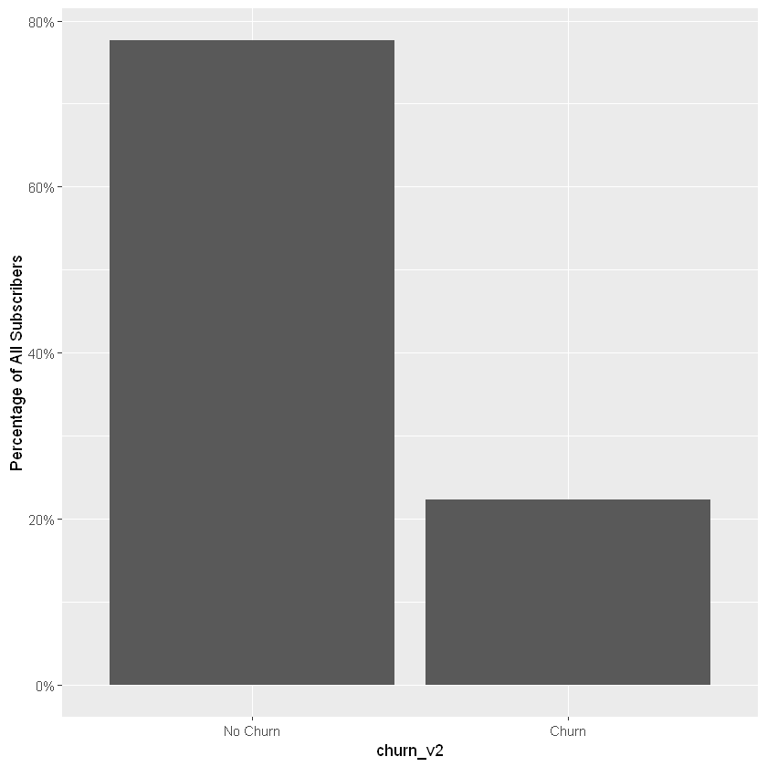


```R
#Let's look at average weight change per month as a function of average visits per month: we expect a high correlation
g2 <- ggplot(model_data_discrete, aes(x = avg_visits, y = avg_weight_change))+
  geom_point(aes(colour = churn_v2))+
  geom_smooth(method = 'loess', formula = y ~ x)+
  facet_wrap(~`first_month_weightgain binned`)
  

g2
```


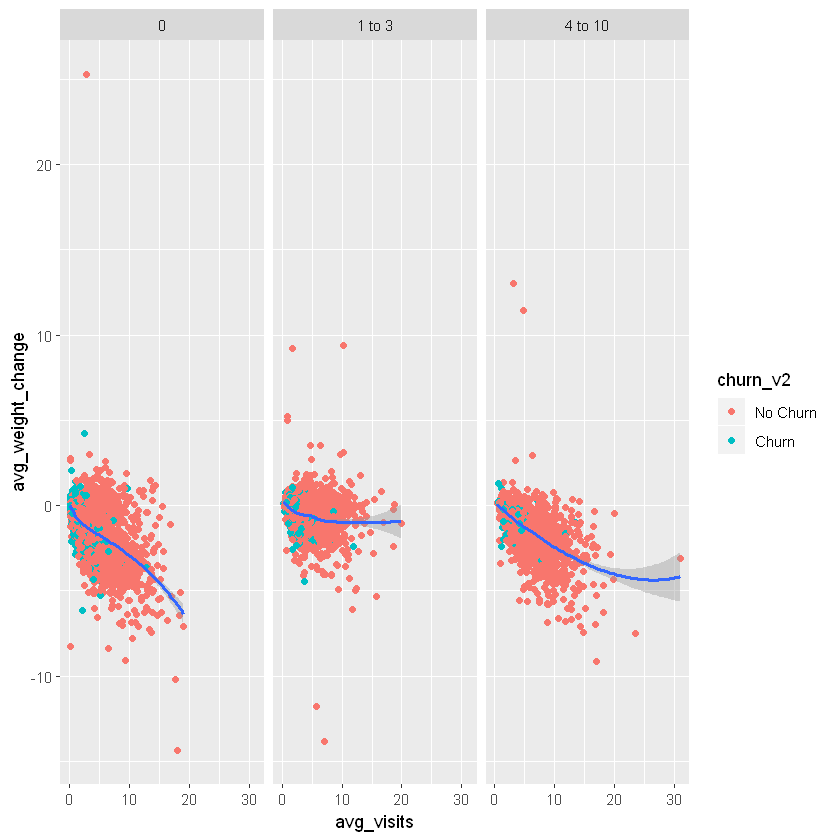


```R
#Now lets look at membership type avg weight change and churn
boxplot_1 <- qplot(x = as.factor(model_data_discrete$churn_v2), y = avg_weight_change, data = model_data,geom="boxplot", 
                 fill = membership, main = "Membership and Weight Change - Churn",xlab = 'No Churn vs Churn')
boxplot_1
```


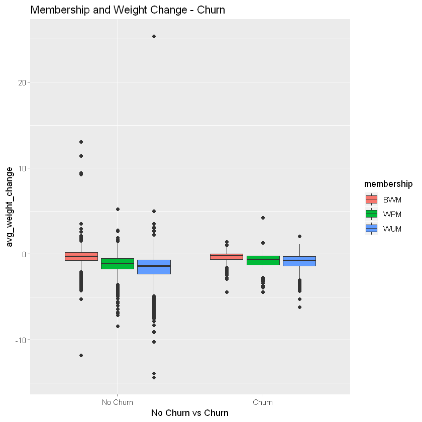


```R
#Now lets look at first month sub lost weight vs avg weight change and churn

boxplot_2 <- qplot(x = as.factor(churn_v2), y = avg_weight_change, data = model_data_discrete,geom="boxplot", 
                   fill = `first_month_weightlost binned`, main = "First Month Lost Weight vs Avg Total Weight Change - Churn",
                  xlab = 'No Churn vs Churn')

boxplot_2
```


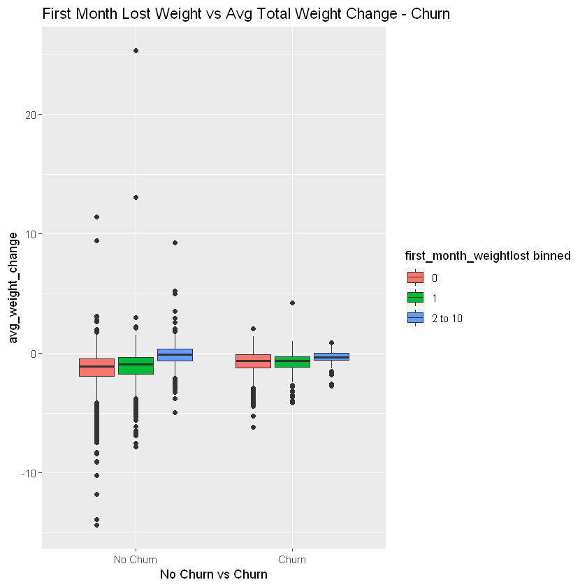


```R
#Now lets look at first month sub gained weight vs avg weight change and churn

boxplot_3 <- qplot(x = as.factor(churn_v2), y = avg_weight_change, data = model_data_discrete,geom="boxplot", 
                   fill = `first_month_weightgain binned`, main = "First Month Gained Weight and Avg Total Weight Change - Churn",
                  xlab = 'No Churn vs Churn')

boxplot_3
```


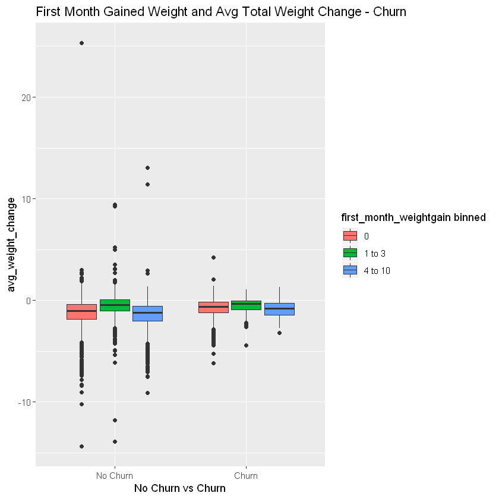


```R
#Now lets look at variability in visits per month vs avg weight change and churn


boxplot_4 <- qplot(x = as.factor(churn_v2), y = avg_weight_change, data = model_data_discrete,geom="boxplot", 
                   fill = `stdev_visits binned`, main = "Variabiltiy in Visits and Avg Total Weight Change - Churn",xlab = 'No Churn vs Churn')
boxplot_4
```


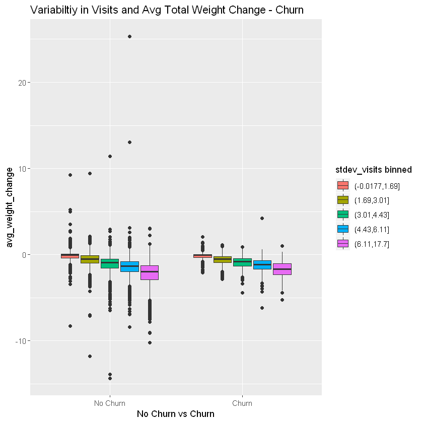


```R
#Now lets look at generation vs avg weight change and churn

boxplot_5 <- qplot(x = as.factor(churn_v2), y = avg_weight_change, data = model_data_discrete,geom="boxplot", 
                   fill = generation, main = "Generation and Avg Total Weight Change - Churn", xlab = 'No Churn vs Churn')
boxplot_5
```


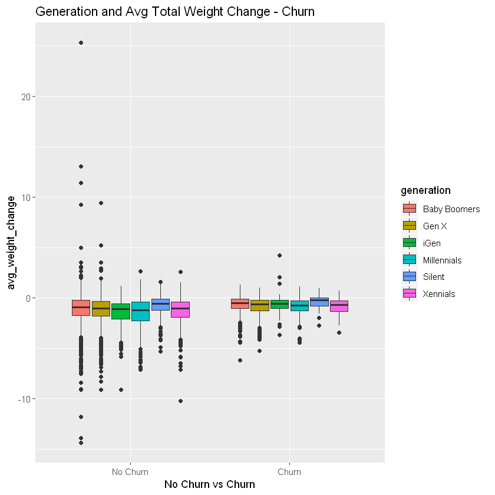


```R
#Need to re-level churn variable since it was throwing off the visualizations
model_data_discrete$churn_v2 <- factor(model_data_discrete$churn_v2,levels(model_data_discrete$churn_v2)[c(2,1)])
```


```R
bar_avg_weight_change <- ggplot(data=model_data_discrete, aes(x=`avg_weight_change binned`, fill = churn_v2)) +
  geom_bar() +
  geom_label(stat='count', aes(label=..count..), position = 'dodge')+
  labs(x = 'Avg Weight Change (lbs) 2018',title = 'Weight Loss v Churn')

bar_avg_weight_change
```

    Warning message:
    "Width not defined. Set with `position_dodge(width = ?)`"


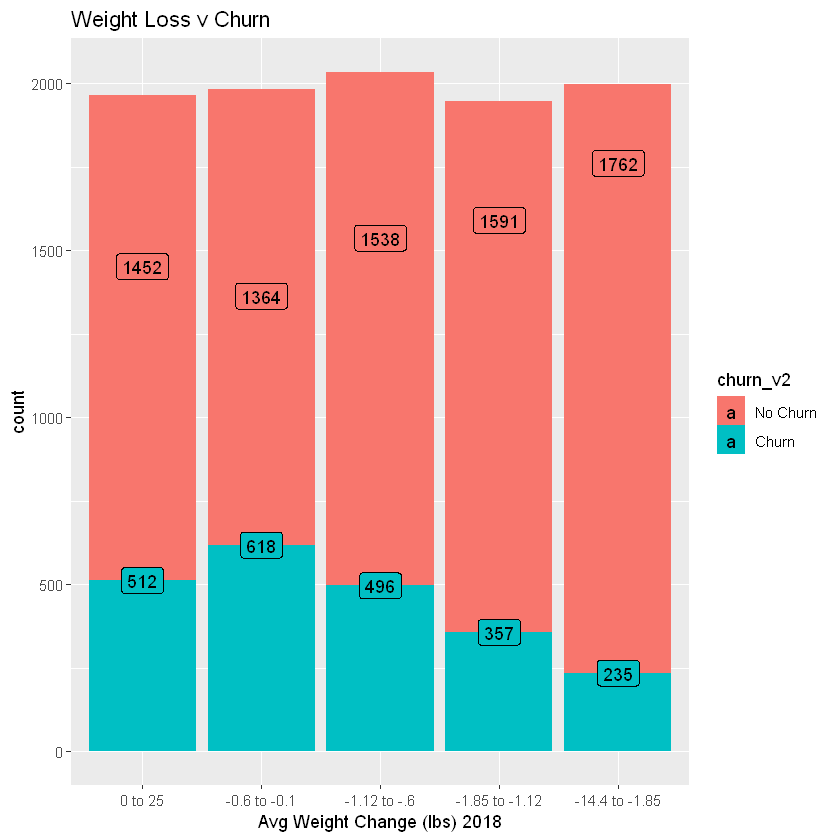


```R
bar_avg_visits <- ggplot(data=model_data_discrete, aes(x=`avg_visits binned`, fill = churn_v2)) +
  geom_bar() +
  geom_label(stat='count', aes(label=..count..), position = 'dodge')+
  labs(x = 'Avg Visits per Month (2018)',title = 'Avg Visits Per Month v Churn')

bar_avg_visits

# bar_avg_visits
```

    Warning message:
    "Width not defined. Set with `position_dodge(width = ?)`"


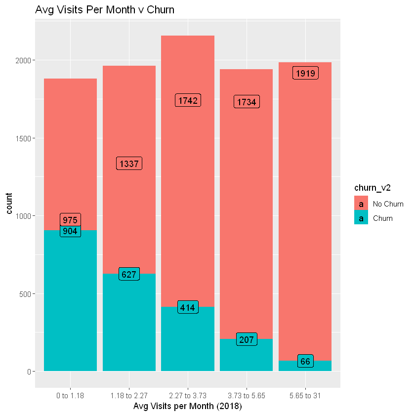


```R
bar_std_weight_change <- ggplot(data=model_data_discrete, aes(x=`stdev_weight_change binned`, fill = churn_v2)) +
  geom_bar() +
  geom_label(stat='count', aes(label=..count..), position = 'dodge')+
  labs(x = 'Std Dev of Weight Change (lbs) in 2018',title = 'Variabilty in Weight Loss v Churn')

bar_std_weight_change
```

    Warning message:
    "Width not defined. Set with `position_dodge(width = ?)`"


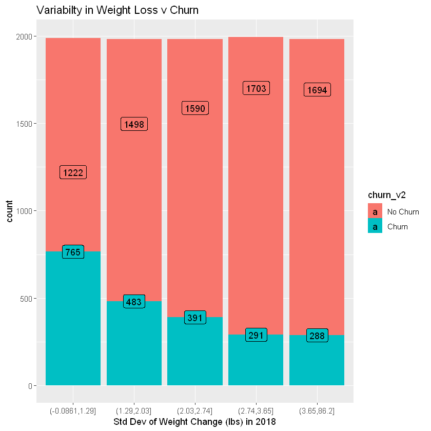


```R
bar_first_month_gain <- ggplot(data=model_data_discrete, aes(x=`first_month_weightgain binned`, fill = churn_v2)) +
  geom_bar() +
  geom_label(stat='count', aes(label=..count..), position = 'dodge')+
  labs(title = 'First Month Weight Gain v Churn', x = "First month of Weight Gain (no weight gain =  0)")

bar_first_month_gain
```

    Warning message:
    "Width not defined. Set with `position_dodge(width = ?)`"


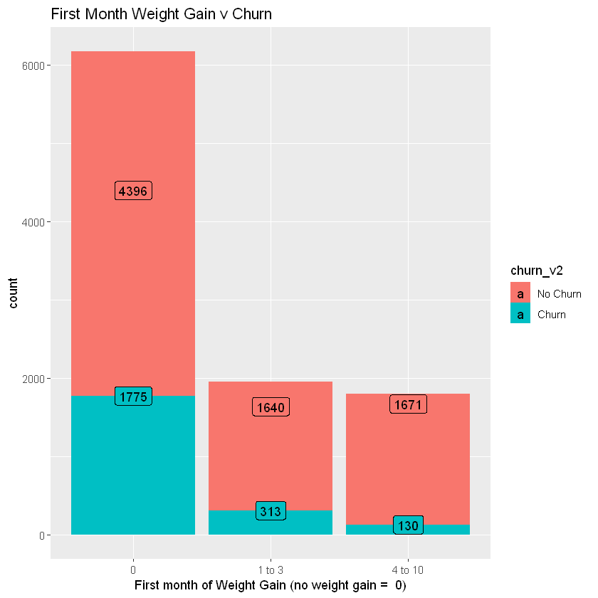


```R
bar_first_month_lost <- ggplot(data=model_data_discrete, aes(x=`first_month_weightlost binned`, fill = churn_v2)) +
  geom_bar() +
  geom_label(stat='count', aes(label=..count..), position = 'dodge')+
  labs(title = 'First Month Weight Lost v Churn', x = "First month (or NA) of Weight Loss")

bar_first_month_lost
```

    Warning message:
    "Width not defined. Set with `position_dodge(width = ?)`"


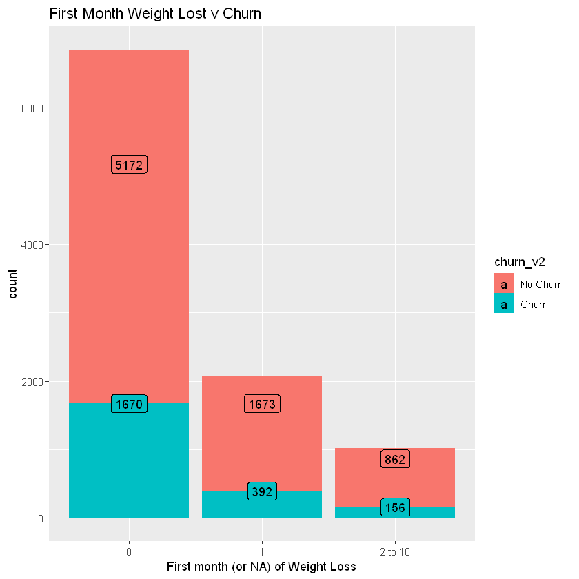


```R
bar_gen <- ggplot(data=model_data_discrete, aes(x=generation, fill = churn_v2)) +
  geom_bar() +
  geom_label(stat='count', aes(label=..count..), position = 'dodge')+
  labs(x = 'Generation',title = 'Generation v Churn')

bar_gen
```

    Warning message:
    "Width not defined. Set with `position_dodge(width = ?)`"


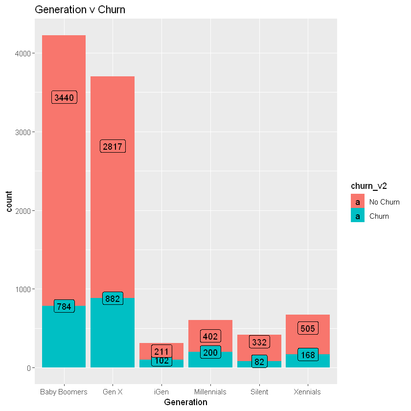


```R
#Highly correlated predictors: make sure we dont include these in certain models to avoid multi-collinearity
```


```R
ggpairs(model_data_discrete[,2:8], columnLabels = c("Avg Wt Chg","Avg Visits","Std Dev Wt Ch ","Std Dev Visits","Consec 0 Visits",
                                                   "1st Mth Wt Loss","1st Mth Wt Gain"))


my_colors <- brewer.pal(nlevels(as.factor(model_data_discrete$churn_v2)), "Set2")
```


    Warning message in eval(expr, envir, enclos):
    "restarting interrupted promise evaluation"Warning message in eval(expr, envir, enclos):
    "internal error -3 in R_decompress1"


    Error in eval(expr, envir, enclos): lazy-load database 'C:/Users/markl/Anaconda3/Lib/R/library/RColorBrewer/R/RColorBrewer.rdb' is corrupt
    Traceback:
    


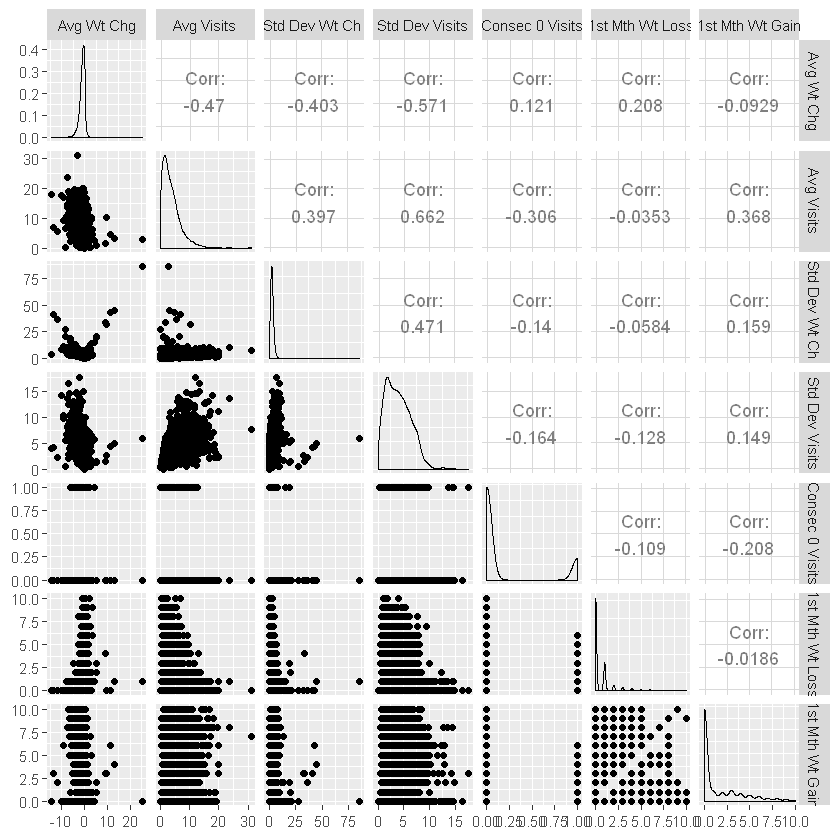


```R
# Split the data into training and test sets; setting our seed to 123 for reproducible results
```


```R
set.seed(123)
train_index <- caret::createDataPartition(model_data_discrete$churn_v2,p = 0.7, list = FALSE)
train_set <- model_data_discrete[train_index,]
test_set <- model_data_discrete[-train_index,]
```


```R
#Using Caret train function, we can pre-process using centering and scaling
```


```R
model_glm <- caret::train(churn_v2 ~ `avg_weight_change binned`+ `avg_visits binned` +`stdev_weight_change binned`+ generation +
                       `stdev_visits binned` + `first_month_weightlost binned`,preProc = c("center","scale"),
             data = train_set, method = "glm", family = "binomial")
 
 
```


```R
model_glm
```


    Generalized Linear Model 
    
    6948 samples
       6 predictor
       2 classes: 'No Churn', 'Churn' 
    
    Pre-processing: centered (23), scaled (23) 
    Resampling: Bootstrapped (25 reps) 
    Summary of sample sizes: 6948, 6948, 6948, 6948, 6948, 6948, ... 
    Resampling results:
    
      Accuracy   Kappa    
      0.7764597  0.1556623
    


```R
#Calling summary on our model to view the coefficients: the coefficients are in relation to the reference level:
#e.g. avg weight change binned reference level is 
summary(model_glm)
```


    
    Call:
    NULL
    
    Deviance Residuals: 
        Min       1Q   Median       3Q      Max  
    -1.6697  -0.7454  -0.3843  -0.1566   2.8576  
    
    Coefficients:
                                                   Estimate Std. Error z value
    (Intercept)                                    -1.67299    0.04367 -38.313
    `\\`avg_weight_change binned\\`-0.6 to -0.1`    0.03189    0.04040   0.789
    `\\`avg_weight_change binned\\`-1.12 to -.6`    0.01780    0.05128   0.347
    `\\`avg_weight_change binned\\`-1.85 to -1.12`  0.02194    0.05848   0.375
    `\\`avg_weight_change binned\\`-14.4 to -1.85`  0.09405    0.07115   1.322
    `\\`avg_visits binned\\`1.18 to 2.27`          -0.44506    0.04308 -10.330
    `\\`avg_visits binned\\`2.27 to 3.73`          -0.87194    0.05496 -15.865
    `\\`avg_visits binned\\`3.73 to 5.65`          -1.30151    0.06708 -19.403
    `\\`avg_visits binned\\`5.65 to 31`            -1.89953    0.08918 -21.300
    `\\`stdev_weight_change binned\\`(1.29,2.03]`  -0.12030    0.04294  -2.802
    `\\`stdev_weight_change binned\\`(2.03,2.74]`  -0.11360    0.05141  -2.210
    `\\`stdev_weight_change binned\\`(2.74,3.65]`  -0.19656    0.05925  -3.318
    `\\`stdev_weight_change binned\\`(3.65,86.2]`  -0.16862    0.06724  -2.508
    `generationGen X`                               0.06154    0.03511   1.753
    generationiGen                                  0.03182    0.02911   1.093
    generationMillennials                           0.13986    0.02978   4.697
    generationSilent                               -0.02462    0.03480  -0.708
    generationXennials                              0.02179    0.03192   0.683
    `\\`stdev_visits binned\\`(1.69,3.01]`          0.23562    0.04391   5.366
    `\\`stdev_visits binned\\`(3.01,4.43]`          0.38702    0.05451   7.100
    `\\`stdev_visits binned\\`(4.43,6.11]`          0.59306    0.06307   9.403
    `\\`stdev_visits binned\\`(6.11,17.7]`          0.85070    0.07475  11.381
    `\\`first_month_weightlost binned\\`1`         -0.12198    0.03359  -3.632
    `\\`first_month_weightlost binned\\`2 to 10`   -0.06690    0.03761  -1.779
                                                   Pr(>|z|)    
    (Intercept)                                     < 2e-16 ***
    `\\`avg_weight_change binned\\`-0.6 to -0.1`   0.429949    
    `\\`avg_weight_change binned\\`-1.12 to -.6`   0.728525    
    `\\`avg_weight_change binned\\`-1.85 to -1.12` 0.707499    
    `\\`avg_weight_change binned\\`-14.4 to -1.85` 0.186224    
    `\\`avg_visits binned\\`1.18 to 2.27`           < 2e-16 ***
    `\\`avg_visits binned\\`2.27 to 3.73`           < 2e-16 ***
    `\\`avg_visits binned\\`3.73 to 5.65`           < 2e-16 ***
    `\\`avg_visits binned\\`5.65 to 31`             < 2e-16 ***
    `\\`stdev_weight_change binned\\`(1.29,2.03]`  0.005086 ** 
    `\\`stdev_weight_change binned\\`(2.03,2.74]`  0.027139 *  
    `\\`stdev_weight_change binned\\`(2.74,3.65]`  0.000907 ***
    `\\`stdev_weight_change binned\\`(3.65,86.2]`  0.012153 *  
    `generationGen X`                              0.079678 .  
    generationiGen                                 0.274495    
    generationMillennials                          2.64e-06 ***
    generationSilent                               0.479225    
    generationXennials                             0.494805    
    `\\`stdev_visits binned\\`(1.69,3.01]`         8.05e-08 ***
    `\\`stdev_visits binned\\`(3.01,4.43]`         1.25e-12 ***
    `\\`stdev_visits binned\\`(4.43,6.11]`          < 2e-16 ***
    `\\`stdev_visits binned\\`(6.11,17.7]`          < 2e-16 ***
    `\\`first_month_weightlost binned\\`1`         0.000282 ***
    `\\`first_month_weightlost binned\\`2 to 10`   0.075268 .  
    ---
    Signif. codes:  0 '***' 0.001 '**' 0.01 '*' 0.05 '.' 0.1 ' ' 1
    
    (Dispersion parameter for binomial family taken to be 1)
    
        Null deviance: 7383.3  on 6947  degrees of freedom
    Residual deviance: 6105.6  on 6924  degrees of freedom
    AIC: 6153.6
    
    Number of Fisher Scoring iterations: 6
    


```R
 exp(coef(model_glm$finalModel))

```


<dl class=dl-horizontal>
	<dt>(Intercept)</dt>
		<dd>0.187685567532751</dd>
	<dt>`\`avg_weight_change binned\`-0.6 to -0.1`</dt>
		<dd>1.03240065867754</dd>
	<dt>`\`avg_weight_change binned\`-1.12 to -.6`</dt>
		<dd>1.01795921709995</dd>
	<dt>`\`avg_weight_change binned\`-1.85 to -1.12`</dt>
		<dd>1.02218646551179</dd>
	<dt>`\`avg_weight_change binned\`-14.4 to -1.85`</dt>
		<dd>1.09861814736394</dd>
	<dt>`\`avg_visits binned\`1.18 to 2.27`</dt>
		<dd>0.640783935645558</dd>
	<dt>`\`avg_visits binned\`2.27 to 3.73`</dt>
		<dd>0.418137808069444</dd>
	<dt>`\`avg_visits binned\`3.73 to 5.65`</dt>
		<dd>0.272120876725571</dd>
	<dt>`\`avg_visits binned\`5.65 to 31`</dt>
		<dd>0.1496383762496</dd>
	<dt>`\`stdev_weight_change binned\`(1.29,2.03]`</dt>
		<dd>0.886652852903277</dd>
	<dt>`\`stdev_weight_change binned\`(2.03,2.74]`</dt>
		<dd>0.892618104139229</dd>
	<dt>`\`stdev_weight_change binned\`(2.74,3.65]`</dt>
		<dd>0.821550038540652</dd>
	<dt>`\`stdev_weight_change binned\`(3.65,86.2]`</dt>
		<dd>0.844830856041583</dd>
	<dt>`generationGen X`</dt>
		<dd>1.06347145314762</dd>
	<dt>generationiGen</dt>
		<dd>1.03232655308894</dd>
	<dt>generationMillennials</dt>
		<dd>1.15011599417312</dd>
	<dt>generationSilent</dt>
		<dd>0.975677886453767</dd>
	<dt>generationXennials</dt>
		<dd>1.02203336214902</dd>
	<dt>`\`stdev_visits binned\`(1.69,3.01]`</dt>
		<dd>1.26569561599665</dd>
	<dt>`\`stdev_visits binned\`(3.01,4.43]`</dt>
		<dd>1.47258895995261</dd>
	<dt>`\`stdev_visits binned\`(4.43,6.11]`</dt>
		<dd>1.80951210155925</dd>
	<dt>`\`stdev_visits binned\`(6.11,17.7]`</dt>
		<dd>2.34128600427277</dd>
	<dt>`\`first_month_weightlost binned\`1`</dt>
		<dd>0.885164972409653</dd>
	<dt>`\`first_month_weightlost binned\`2 to 10`</dt>
		<dd>0.935288597652486</dd>
</dl>


```R
model_glm_2 <- caret::train(churn_v2 ~ `avg_weight_change binned`+ `avg_visits binned` + generation
                               , data = train_set, method = "glm", family = "binomial")
```


```R
model_glm_2
```


    Generalized Linear Model 
    
    6948 samples
       3 predictor
       2 classes: 'No Churn', 'Churn' 
    
    No pre-processing
    Resampling: Bootstrapped (25 reps) 
    Summary of sample sizes: 6948, 6948, 6948, 6948, 6948, 6948, ... 
    Resampling results:
    
      Accuracy   Kappa    
      0.7734036  0.1143439
    


```R
predictions_glm_2 <- predict(model_glm_2,test_set, type = "prob")
colnames(predictions_glm_2) <- c('NoChurn','Churn')

```

## Evaluating Class Probabilities with ROC Curves and AUC (Area under the Curve)
The Receiver Operating Characteristic (ROC) curve is used to assess the accuracy of a continuous measurement for predicting a binary outcome. What is the tradeoff between sensitivity (predicting churn events correctly, aka true positive) versus specificity (non churn samples are predicted as non churn) and at what cut-off level are the two optimized?
ROC is about 'model discrimination' and telling two classes apart. 


```R
#Lets' look at the AUC for our Logistic Regression model version 2 (just has 2 predictors: average weight change and average visits)
# The 0.22 is the cutoff since that is the rate in the population of churn. We can adjust this level but will leave alone for this
#exercise. 
result.roc <- roc(test_set$churn_v2, predictions_glm_2$Churn) # Draw ROC curve.
 plot(result.roc, print.thres="best", print.thres.best.method="closest.topleft")
print(paste("The area under the curve for Glm 2 is",result.roc$auc))
```

    [1] "The area under the curve for Glm 2 is 0.760434282071962"
    


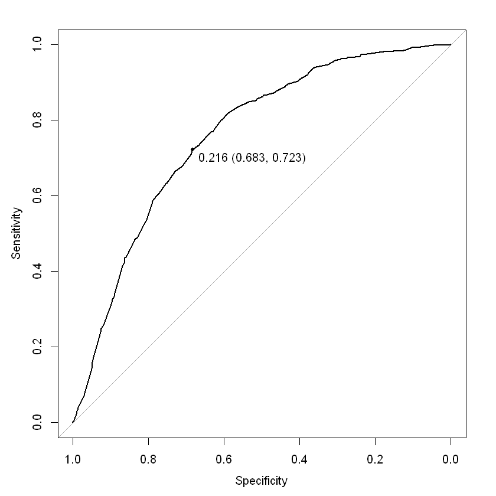


```R
#Running another logistic regression model but we are adding another variable 'first month weight gain binned' 
model_glm_4 <- caret::train(churn_v2 ~ `avg_weight_change binned`+ `avg_visits binned` +  `first_month_weightgain binned`
                             , data = train_set, method = "glm", family = "binomial")
 predictions_glm_4 <- predict(model_glm_4,test_set, type = "prob")

colnames(predictions_glm_4) <- c('NoChurn','Churn')
result.roc_glm4 <- roc(test_set$churn_v2, predictions_glm_4$Churn) # Draw ROC curve.
 plot(result.roc_glm4, print.thres="best", print.thres.best.method="closest.topleft")
print(paste("The area under the curve for Glm 4 is",result.roc_glm4$auc))
```

    [1] "The area under the curve for Glm 4 is 0.759122720295549"
    


```R
model_knn <- train(churn_v2 ~ `avg_weight_change binned`+ `avg_visits binned` + generation
                   , data = train_set, method = "knn",
                   preProc = c("center","scale"),
                   tuneGrid = data.frame(.k = 1:20),
                   trControl = trainControl(method = "cv"))
predictions_knn <- predict(model_knn,test_set, type = "prob")
```


```R
#
result.roc.knn <- roc(test_set$churn_v2, predictions_knn$Churn) # Draw ROC curve.
plot(result.roc.knn, print.thres="best", print.thres.best.method="closest.topleft")
print(paste("The area under the curve for KNN is",result.roc.knn$auc))
```

    [1] "The area under the curve for KNN is 0.752327509951349"
    


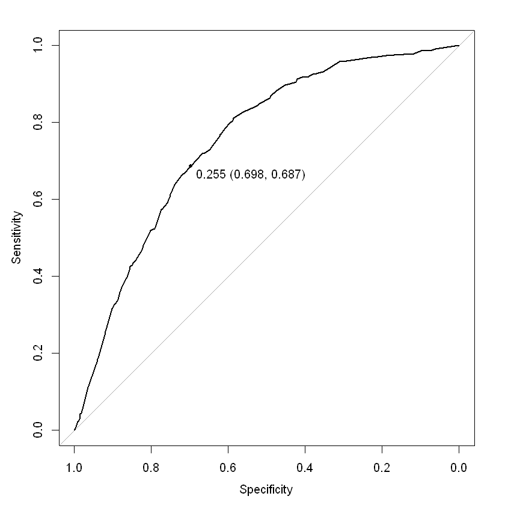


```R
#Lets take a look at all three models together

gg_first_3_mods_ROC <- ggroc(list(glm = result.roc, glm_4 = result.roc_glm4, knn = result.roc.knn))
gg_first_3_mods_ROC + ggtitle('Logistic Regression v2 & v4 and KNN - ROC Curves')
```


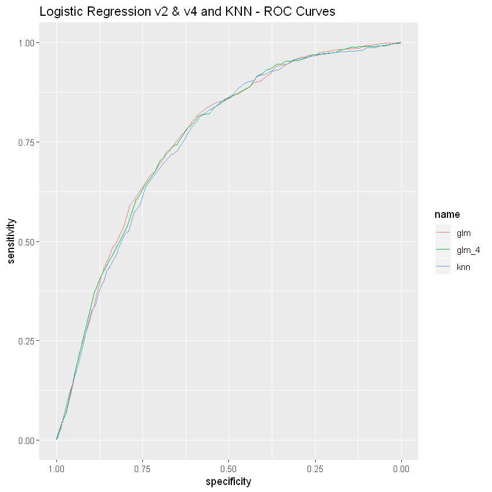

